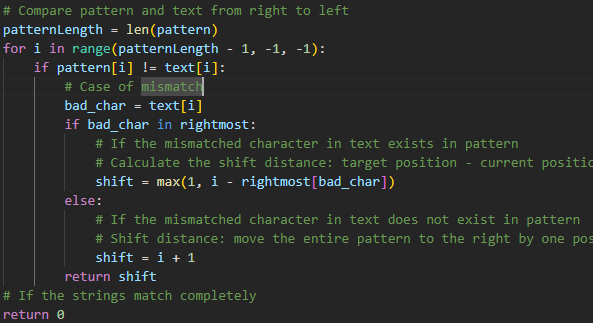

# CPT212_Assignment2

#### 项目结构

```
仓库中 Assignment2.ipynb 是我们主要的文件 这个文件里集成并实现了完整的功能
相关引用我都标注在了文件中

这是我坏字符串启发的相关文件
bad_character_heuristic_test.py
bad_character_heuristic.py
其中 bad_character_heuristic_test.py 是测试文件
bad_character_heuristic.py 是实现文件

下面两个是好后缀启发的相关文件
good_suffix_shift.py
good_suffix_shift2.py

good_suffix_shift.py 文件是我从各方找资料编写的实现
good_suffix_shift2.py 文件是我从网上找到的实现 相关引用我都标注在了文件中

```

#### 功能说明


在Assignment2.ipynb中 我们实现了两种启发式算法  
你可以根据注释或者文档来理解我里面函数的功能 例如

注释  
  

文档  
  

或者你可以使用调试功能和自带的日志功能(仅仅在好后缀启发相关方法中)  
  
默认为False 传入True即可开启  

当然 主函数里也有选项可以打开  
  
开启会显示  
  
关闭的话仅仅会显示  
  


#### 函数说明（仅针对Assignment2.ipynb）


def bad_character_heuristic(pattern, text)
这个函数是坏字符启发的实现 返回的是移动的位置

def good_suffix_shift(pattern, enable_print=False)
这个函数是好后缀启发的实现 返回的是移动的数组也就是goodSuffix数组

def good_suffix_heuristic(pattern, text, enable_print=False)
这个函数是好后缀启发的实现 可以算是一个整合函数 调用了good_suffix_shift 使得返回值可以像bad_character_heuristic一样 返回的是移动的位置

def boyer_moore(pattern, text, enable_print=False, enable_suffix_print=False)
这个函数是整合了两种启发式算法的实现 返回的是匹配到的位置的列表

